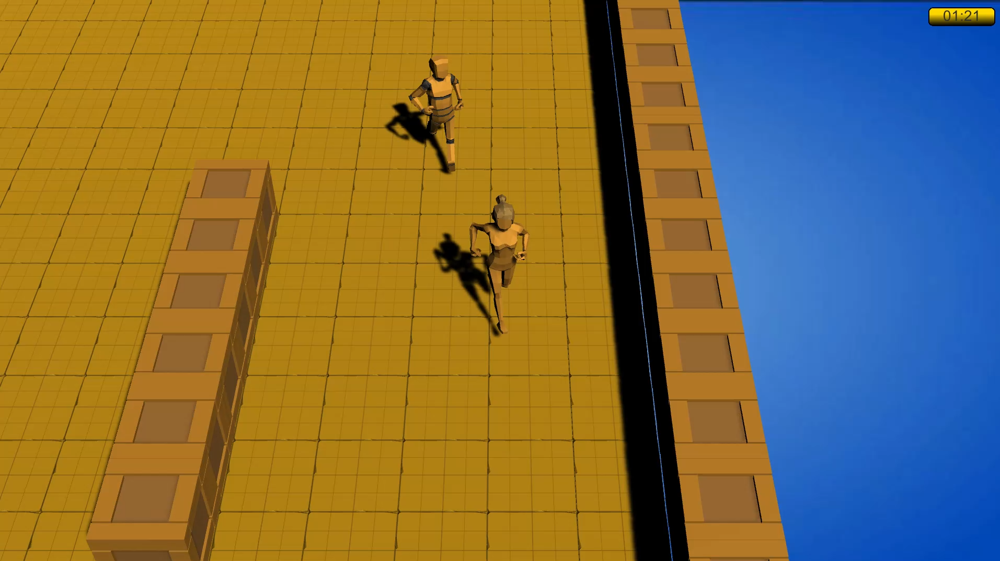
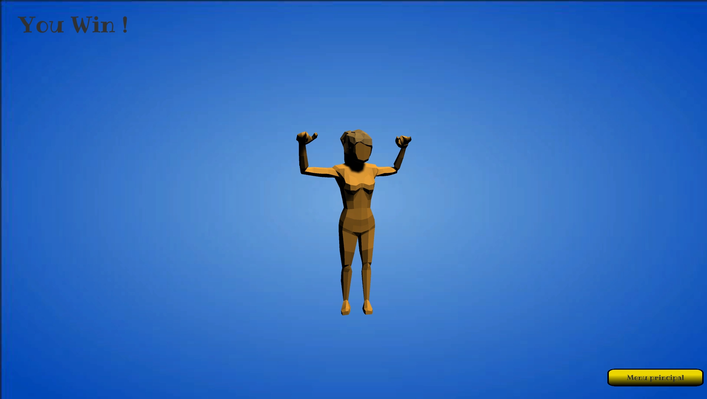
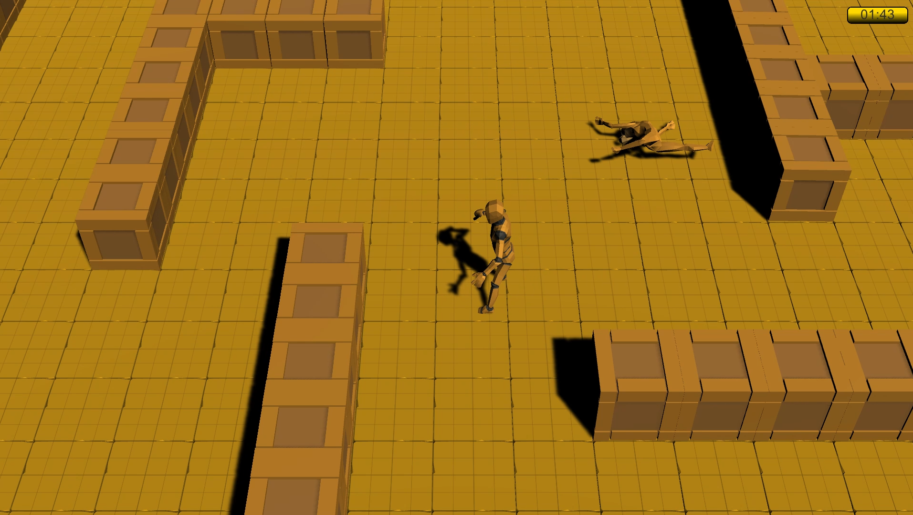
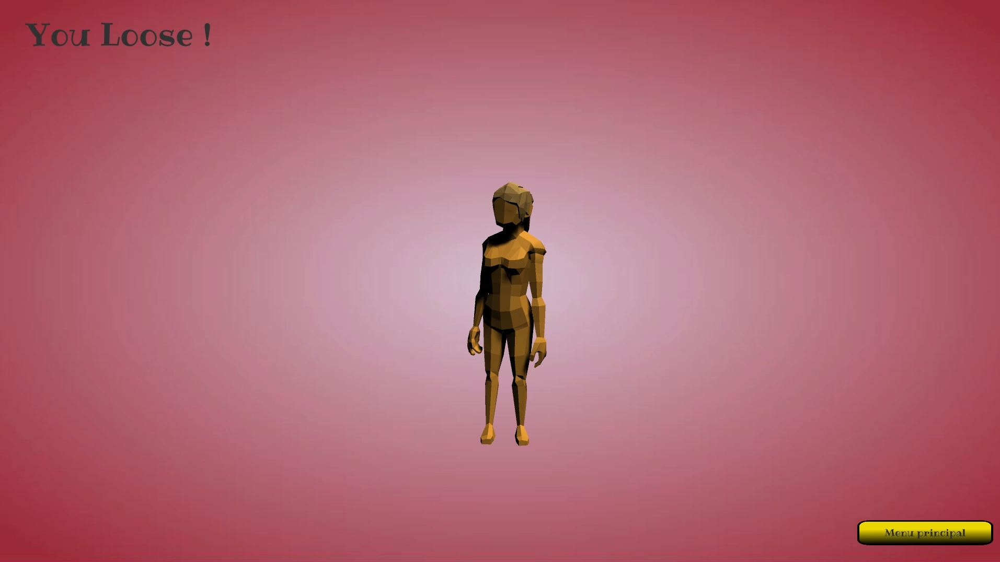

# Mecanim

## Description
Projet effectué dans le cadre de la formation au module d'animation Mecanim dans Unity.
Le but de l'examen est de reprendre certains aspects du jeu Brawl Stars par Supercell.

## Fontionnalités
### Scène de lancement de partie
- Le personnage a un idle "maître", à chaque fois que ce idle a parcourus 90% de l'animation il lance l'un des idles secondaire aléatoirement.  
- Il fait une animation "Prêt au combat" quand on lance une partie.

### Scène de gameplay
- Déplacements du personnage sur les axes x et z avec une vitesse adapté à l'intensité appliqué aux inputs.  
- Camera qui suit le personnage sur la hauteur de l'écran.
- Possibilité d'attaquer en face de soi en se déplaçant.
- Au moins 2 animations faites directement dans Unity.
- Personnage ennemi qui fait une ronde et qui court après le joueur quand il est à une certaine distance, il revient à son point initiale quand il a perdu le joueur de vue.  
- Le but du jeu est de tuer l'ennemi en moins de 2mn.
- Mort en Ragdoll de l'ennemi ou du player si 2mn sont écoulées.

### Scène de fin de partie
- Animation de victoire.
- Animation de défaite (Si le personnage ennemi n'a pas été détruit dans les 2mn).

## Screen

> Modélisations, textures, rig sont des assets venant de l'enseignant.